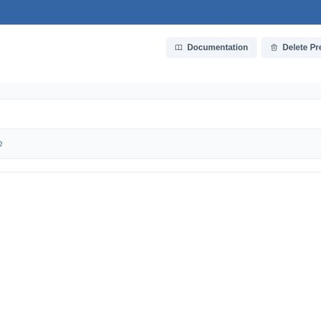
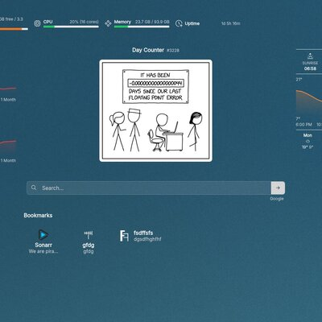
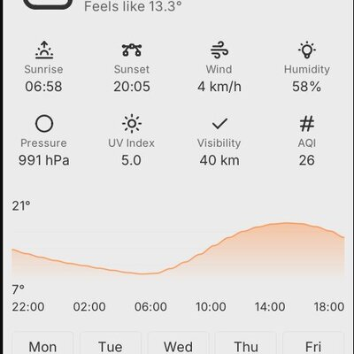

#  Dashi

A self-hosted personal landing page with a built-in visual editor, theme support,
and server-side PNG rendering for e-ink displays and home dashboards.
No database required -- all configuration and assets are stored as plain files on disk.

## Screenshots

<p>
  <a href="zarf/sreenshots/editor_list.jpg"></a>
  <a href="zarf/sreenshots/editor.jpg"></a>
  <a href="zarf/sreenshots/screenshot.jpg"></a>
  <a href="zarf/sreenshots/e-ink.jpg"></a>
</p>

## Quick Start

```bash
# Generate a default config file
dashi generate-config > config.yaml

# Start the server
dashi start --config config.yaml
```

Open `http://localhost:8087` in your browser. From there you can create
dashboards, add widgets, and configure them through the built-in editor.


## Features

### Dashboard Management

- **Multi-page dashboards** with tab navigation
- **Two rendering modes:**
  - **Interactive** -- live Vue.js web app with real-time data
  - **Image** -- server-side PNG for e-ink displays, status monitors, etc.
- **Flexible layout** -- 12-column grid, configurable rows, alignment, max width
- **Backgrounds** -- solid color, gradient, or image (from theme or uploads)
- **Color modes** -- auto (follows OS preference), light, or dark
- **Themes** -- customizable fonts and icon sets (default: Inter + Tabler icons)
- **Custom CSS** -- per-dashboard sidecar files for advanced styling
- **Widgets:**
  - **Weather** -- current conditions, hourly/7-day forecast, graph (Open-Meteo)
  - **Market** -- stock/ETF/crypto/FX prices with chart (Yahoo Finance)
  - **Bookmarks** -- configurable links with title and subtitle
  - **Clock** -- configurable time format, date, and theme fonts
  - **Search** -- search bar with configurable engine
  - **Page Indicator** -- dot indicator for multi-page navigation

### Data & Caching

- All data stored as flat files (JSON + assets) -- no database required
- Weather data cached for 30 minutes, pre-fetched at startup
- Market data cached with tiered TTLs based on data freshness needs
- Both weather and market data are warmed up at startup by scanning dashboard configs

## Tech Stack

- **Backend:** Go (Cobra CLI, Gorilla Mux, slog)
- **Frontend:** Vue.js 3 (Composition API, PrimeVue, Vue Query, Vite)
- **Image rendering:** litehtml-go + Go image libraries
- **Charts:** fogleman/gg (server-side PNG), inline SVG (frontend)
- **Structure:** Monorepo -- single binary with embedded frontend

## Development

### Prerequisites

- Go 1.25+
- Node.js 22+

### Running

```bash
# Start backend (debug mode, built-in defaults)
make run

# Build frontend and start backend with embedded UI
make run-ui

# Frontend dev server (hot reload, proxies API to backend)
cd webui && npm run dev
```

### Testing

```bash
make test          # Go unit tests
make ui-test       # Vue.js unit tests
make lint          # Go linter
make coverage      # Enforce 70% coverage on internal packages
make verify        # Run all checks
```

### Building

```bash
make build         # Build binary for current OS/arch (includes frontend)
make package-ui    # Build frontend and embed in Go package
```

### Configuration

Generate a default config file:

```bash
dashi config
```

Configuration is loaded in order (last wins):
1. Built-in defaults
2. `.env` file (optional)
3. `config.yaml` (optional)
4. Environment variables (prefix: `DASHI_`)
